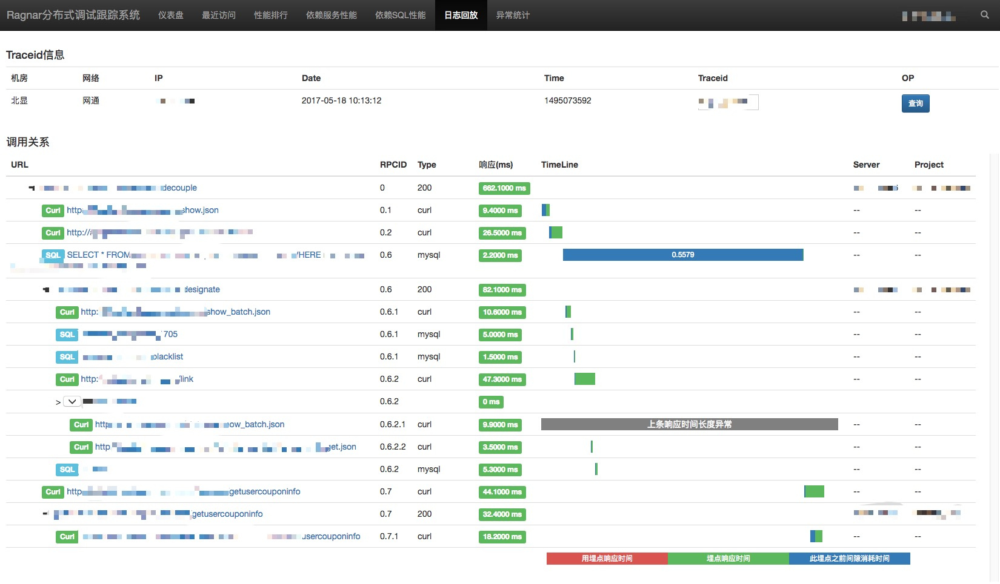

Fiery
====== 

 

[中文文档](./README_CN.md)
 

 Fiery is an APM-Application Performance Management for the PHP

### Introduction
 * All Service in an jar.easy to deploy
 * Burial SDK: integrated burial package for php project
 * Log Pusher: collect the ragnarsdk logs and push to the server
 * Server: index, storage, statistics the logs, web Management interface
 * Goto [wiki](https://github.com/weiboad/fiery/wiki) to get More Infomation
 
### Requirements
 * PHP 5.3 or later with bcmath
 * Linux, OS X and Windows
 * Memory: 2G or more 
 * Java 8 Runtime

### Getting Started
 1. Download [Java 8 Runtime](http://www.oracle.com/technetwork/java/javase/downloads/jdk8-downloads-2133151.html)
 2. tar xvf jdk-1.8.tar.gz
 3. Download Recent Relasese Jar on [Release page](https://github.com/weiboad/fiery/releases)
 4. mkdir logs index db
 5. Startup the Fiery Server by command:

> nohup java -XX:-MaxFDLimit -Xms3750m -Xmx3750m -XX:ReservedCodeCacheSize=240m -XX:+UseCompressedOops -jar ragnarserver-0.5.3-SNAPSHOT.jar --server.port=9090 &

 6. Browse the web address http://127.0.0.1:9090/ragnar/

### Burial SDK
 * [Integrated On PHP Project](https://github.com/weiboad/fierysdk/blob/master/README.md)

### LogPusher

>  nohup java -XX:-MaxFDLimit -Xms128m -Xmx450m -XX:ReservedCodeCacheSize=240m -XX:+UseCompressedOops -jar logpusher-0.5.3-SNAPSHOT.jar  -c ./conf/logpusher.properties &

Tips: now the log pusher supported the kafka 0.9(if you want new version kafka please change pom.xml kafka client depend  version)

### Parameter And Config file
 Log pusher(use config file, cmd option -c specified [config file](./conf/logpusher.properties) path)

|     parameter   |      option   |   desc    |
| --------------- |:-------------:| ---------:|
|path            | the ragnarsdk log path | which variable defined on nginx parameter|
|outTime         | log expire clean up day| when the monitored file expire by day will clean up by log pusher |
|pushType       | http(default) kafka(for the mass log user)|the way you push log to server|
|host            | 127.0.0.1:9090 | only for http push type,set the fiery server ip:port|
|threadCount     | 8  |when you using push type http,will improve the push speed but expensive|
|kafkaServer    | 10.10.1.1:9192,10.10.1.2:9192| kafka broker ip:port,ip:port list|
|kafkaTopic    | fiery_test|kafka push topic|

Server(use cmd option)

|     Parameter   |      option   |   desc    |
| --------------- |:-------------:| ---------:|
|--server.port    | 9090| fiery server listened port|
|--fiery.kafkaenable|true false| using kafka ?|
|--fiery.kafkaserver|10.1.1.1:9191,10.1.1.2:9191|kafka broker ip:port,ip:port list|
|--fiery.kafkatopic|kafka topic|kafka topic.mutiple topic eg:fiery_test,fiery_test1|
|--fiery.kafkagroupid|kafka groupid|kafka groupid|
|--fiery.keepdataday|how long the data keep day|the day of log keep|

#### Todo
 * Service Manage Shell(startup stop restart)
 * Persistent memory statistics
 * Statsd

#### Depend Package
> * Alibaba Druid
> * Spring Boot
> * Facebook RocksDB
> * Lucene
> * Google Gson

## Contact Us
 * WeiboAD ADINF Team
 * QQ Group: 318051466
 
